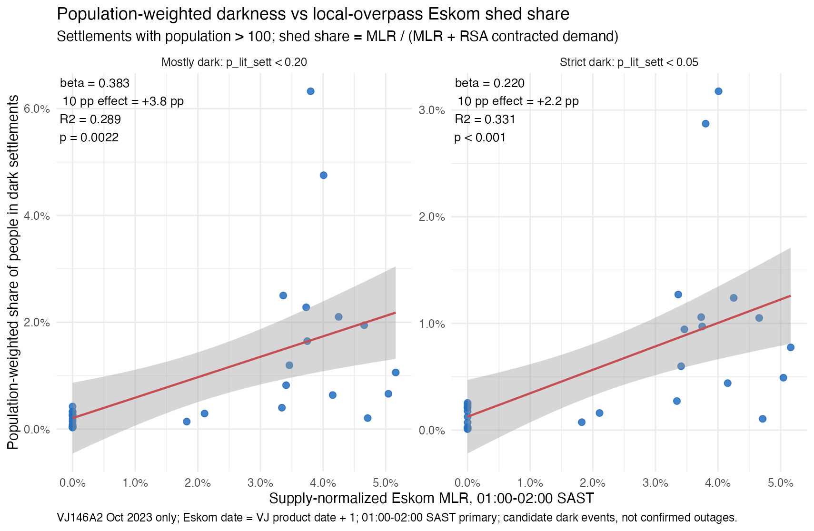
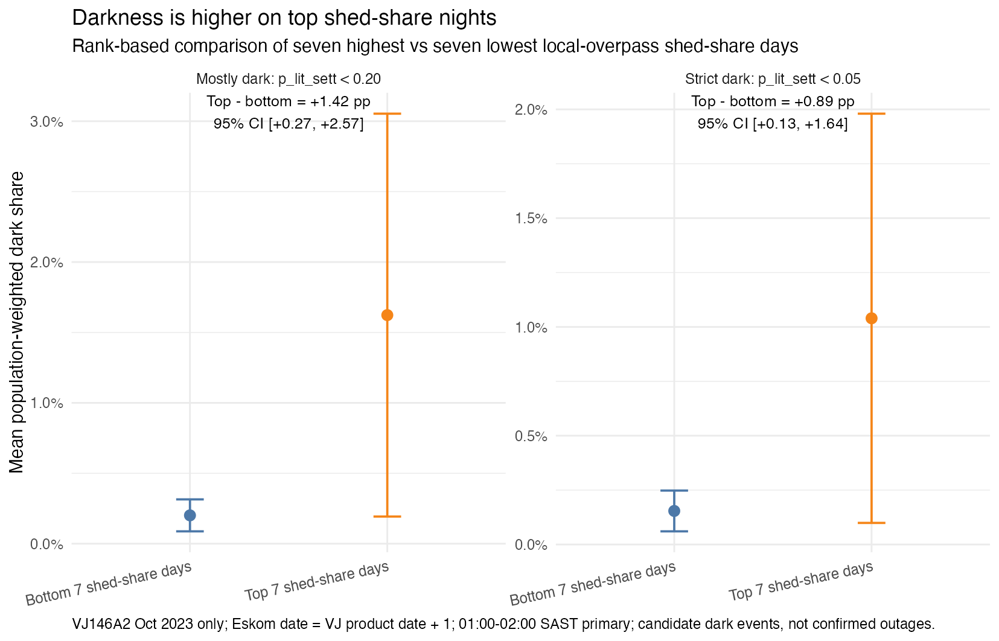
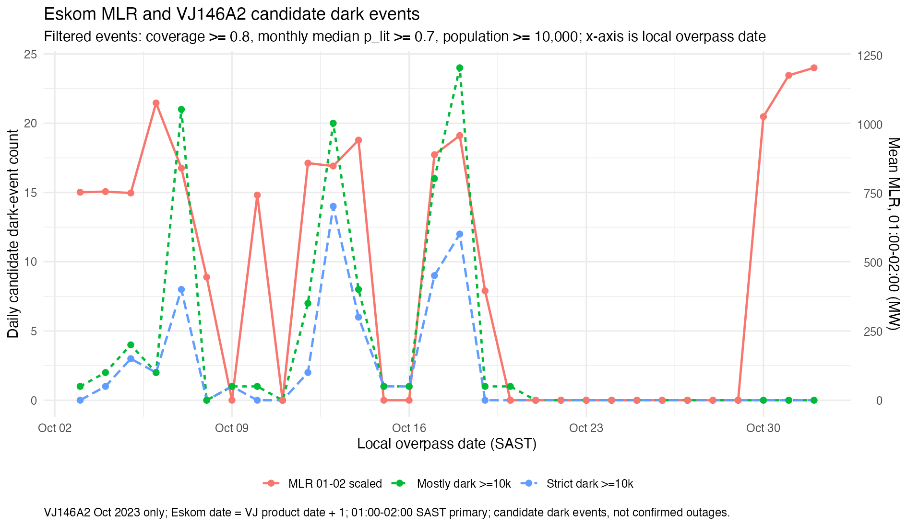
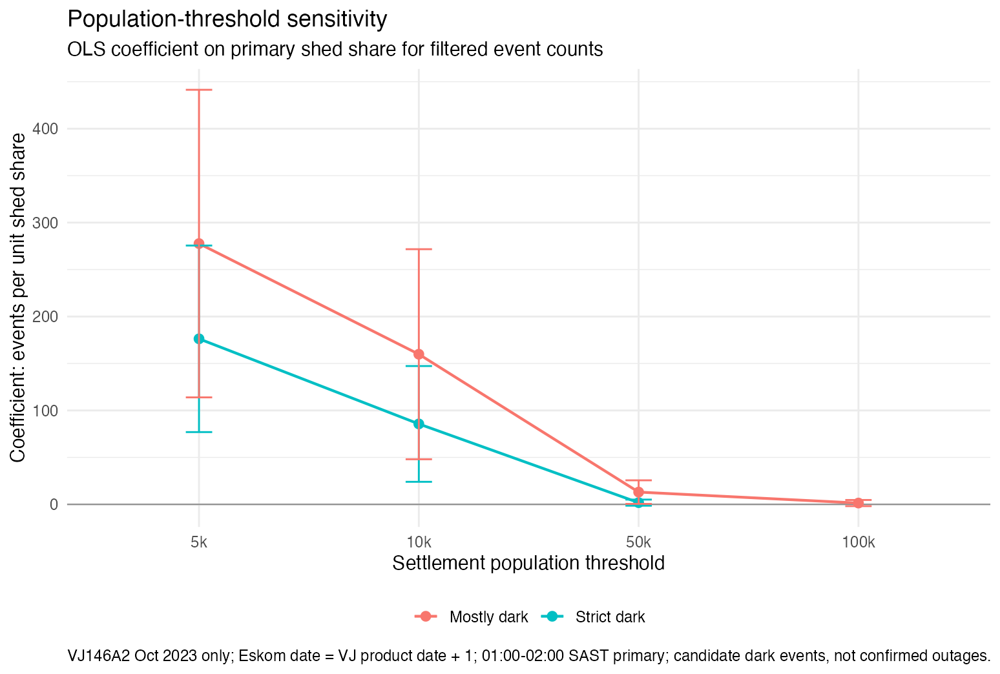

```{r setup, include=FALSE}
knitr::opts_chunk$set(echo = FALSE, message = FALSE, warning = FALSE)
ravi <- read.csv("vj146a2_oct2023_mlr_validation_ravi_style_table.csv", check.names = FALSE)
fmt_num <- function(x, digits = 3) ifelse(is.na(x), "NA", sprintf(paste0("%.", digits, "f"), x))
fmt_p <- function(p) ifelse(is.na(p), "NA", ifelse(p < 0.001, "<0.001", sprintf("%.4f", p)))
continuous <- ravi[ravi$model_type == "ravi_continuous_shed_share", ]
strict <- continuous[continuous$outcome == "popw_strict_dark_share", ]
mostly <- continuous[continuous$outcome == "popw_mostly_dark_share", ]
display <- ravi[, c("model_type", "outcome", "n", "estimate", "p_value", "r_squared", "effect_pp")]
display$Spec <- ifelse(display$model_type == "ravi_continuous_shed_share", "Headline continuous", ifelse(display$model_type == "ravi_rank_top7_vs_bottom7", "Headline top 7 vs bottom 7", "Robust tied-zero quartile"))
display$Outcome <- ifelse(display$outcome == "popw_strict_dark_share", "Strict (<0.05)", "Mostly (<0.20)")
display$estimate <- fmt_num(display$estimate, 4)
display$p_value <- fmt_p(display$p_value)
display$r_squared <- fmt_num(display$r_squared, 3)
display$effect_pp <- fmt_num(display$effect_pp, 2)
display <- display[, c("Spec", "Outcome", "n", "estimate", "p_value", "r_squared", "effect_pp")]
names(display) <- c("Specification", "Outcome", "N", "Estimate", "p", "R2", "Effect, pp")
```

## Validation Question

Corrected October 2023 VJ146A2 results show a positive validation relationship between local-overpass Eskom MLR and satellite-observed nighttime darkness.

The validation question is whether days with higher national Eskom manual load reduction at the VIIRS local overpass window also show higher population-weighted darkness in the settlement panel. The headline outcome is the population-weighted share of people in dark settlements, restricted to settlements with population greater than 100.

## Methodology

- Date handling: `vj_product_date = date`; `local_overpass_date = VJ product date + 1`.
- Eskom exposure: local-clock hour beginning 01:00 SAST, interpreted as the 01:00-02:00 overpass window.
- Predictor: `legacy shed_share_1_2am_primary used a sum denominator; current validation uses MLR / RSA Contracted Demand`.
- Darkness definitions: strict dark is `p_lit_sett < 0.05`; mostly dark is `p_lit_sett < 0.20`.
- Sample: October 2023 VJ146A2 product dates with matched Eskom local-overpass exposure; settlements with population greater than 100.

The continuous models use all 30 matched October VJ dates. The extreme-bin headline compares the seven highest vs seven lowest shed-share dates. The tied-zero bottom-quartile row is a robustness check because zero-MLR days are tied at the lower quartile.

## Headline Table

```{r table}
knitr::kable(display, align = "llrllll", caption = "Ravi-style national validation models. Continuous effect is for a 10 pp increase in shed share; bin effects are top minus bottom, in percentage points.")
```

For strict darkness, the continuous coefficient is `r fmt_num(strict$estimate, 3)` with R2 `r fmt_num(strict$r_squared, 3)` and p-value `r fmt_p(strict$p_value)`. A 10 percentage-point increase in shed share implies about `r fmt_num(strict$effect_pp, 1)` percentage points higher strict-dark population share.

For mostly-dark settlements, the continuous coefficient is `r fmt_num(mostly$estimate, 3)` with R2 `r fmt_num(mostly$r_squared, 3)` and p-value `r fmt_p(mostly$p_value)`. A 10 percentage-point increase in shed share implies about `r fmt_num(mostly$effect_pp, 1)` percentage points higher mostly-dark population share.

## Figures

```{r ravi-scatter, fig.cap="Population-weighted darkness increases with supply-normalized Eskom MLR in the corrected local-overpass alignment.", out.width="100%"}

```

```{r ravi-extreme, fig.cap="Rank-based top-vs-bottom shed-share comparison. Effects are reported as percentage-point differences in population-weighted darkness.", out.width="100%"}

```

```{r time-series, fig.cap="Existing diagnostic time series of Eskom MLR and large candidate dark-event counts.", out.width="100%"}

```

```{r threshold-sensitivity, fig.cap="Existing population-threshold sensitivity diagnostic for large candidate event counts.", out.width="100%"}

```

## Interpretation

The corrected October diagnostic is positive and supervisor-ready as validation evidence: higher local-overpass Eskom MLR is associated with higher satellite-observed darkness. The strongest report-facing specification is the population-weighted national share, because it asks how many people are in settlements that appear dark rather than how many settlement polygons cross a threshold.

The top-7 vs bottom-7 comparison is a compact robustness view of the same relationship. It should be interpreted as an association around the overpass window, not as proof that individual settlements lost power because of Eskom MLR.

## Caveats

- Eskom MLR is a national proxy, while settlement darkness is local.
- Candidate dark events are not confirmed outages.
- VJ146A2 provides one nighttime snapshot, not full-night service continuity.
- Clouds, private generation, local heterogeneity, and acquisition timing can affect settlement-level darkness.
- The date-alignment convention is grounded at the workflow level; it is not per-pixel acquisition-time proof.
